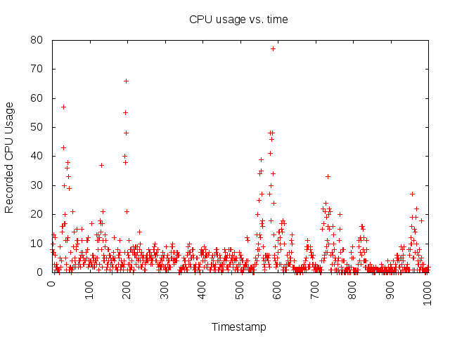
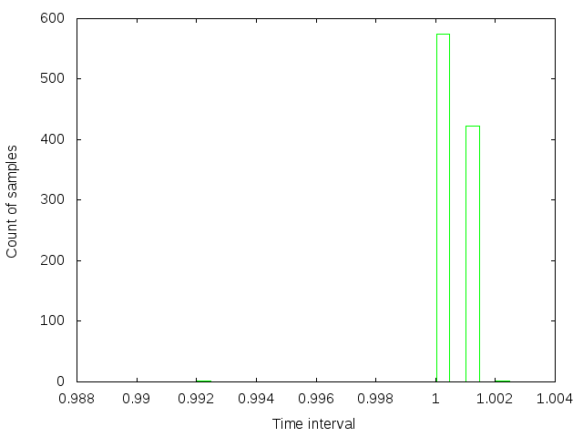

#Assignment 1, Embedded Systems Lab

* **Name**: Rohan Prinja
* **Roll number**: 110050011

##How to log CPU usage?

###vmstat

To measure the CPU usage, we use the `vmstat` command which returns information about processes, memory usage, IO usage, system interrupts and CPU usage. Only the last one is of relevance to us. `vmstat` displays information about the percentage of CPU used by non-kernel code as well as kernel code. We simply add these two quantities to get the net CPU usage at a given instant.

###Our logging mechanism

`vmstat` takes as arguments the delay between two successive reports and the number of reports to generate. So we call `vmstat 1 1000` to get 1000 reports with a 1-second delay. We then pipe the output to a Ruby script file `add-timestamps.rb` which adds a timestamp to each report, and writes to a file. We then run `awk` on the file to filter out the irrelevant information and also add up the user and kernel usage percentages, leaving behind only the timestamp and the net CPU usage in each report. All of this is orchestrated by a bash script called `generate-data.sh`  takes as an argument the number of reports to generate, in this case, 1000. So we just call `./generate-data.sh 1000`.

###Removing noise in the logging data

Sometimes, when runnning the above logger, we get a log file with more than 1000 lines in which we have many instances of the following occurrence: there are two or more consecutive lines having the property that all of these lines have the same timestamp, and all of these lines except the last one show a CPU usage of 0. This is quite easy to eliminate with a simple find-and-replace regex call. We just have to replace the regex ` \d+(\d\d\d)\.\d\d\d? 0\n\d+\1\.\d\d\d? 0\n` with the empty string.

###Plotting the data

To plot the data, we first replace each timestamp in the data by its offset from the first timestamp. The offsetted data is written to the log file `offsetted.txt` using the Ruby script `offset-logs.rb`. Finally, we plot this data using `gnuplot`.

###Graph of recorded  CPU usage vs. time

##Histogram of time intervals between samples vs. count of samples

The histogram is given below in Figure 2. The width of each histogram bucket is 0.0005. As we can see, there are two very frequent buckets, namely, [1, 1.0005) and [1.001, 1.0015), which means that the interval between two consecutive reports from `vmstat` is very close to 1 most of the time. Examining the log file, we see that almost all the intervals are either 1 or 1.001. There are a few outliers. We have one interval value of 0.992. Again examining the log file, we observe that this is the very first interval value. After running `vmstat` a few more times, we realized that the very first interval produced by `vmstat` is always a little less than 1. This appears to be a bug in `vmstat`, so we ignore it.

The histogram is also generated by `gnuplot`. It plots the file `intervals.txt`. This is a file containing the widths of each interval, starting from the interval with lower bound 0 seconds all the way up to the interval with lower bound approximately 999 seconds. To generate this file we run the Ruby script `find-intervals.rb` on the file `offsetted.txt`.

##Why is the inter sample interval not uniformly one second?

The inter sample intervals are not constant because there are many other processes running on the operating system alongside `vmstat`, in particular, the timestamping script mentioned above. This leads to time being lost due to context switching between processes, and cache misses caused by this context switching. So, the sample interval size is not constant because although `vmstat` registers timer events with a period of exactly 1 second, a few thousandths of a second are lost in switching away from `vmstat` to the script that appends a timestamp to the current CPU usage report.

##References
1. [Adding timestamps to `vmstat`](http://www.thegeekstuff.com/2009/08/how-to-add-timestamp-to-unix-vmstat-command-output/)
2. [Understanding the output of `vmstat`](http://www.lazysystemadmin.com/2011/04/understanding-vmstat-output-explained.html)

##Misc

This report was written as a Markdown file `report.md` which was converted to a PDF via `pandoc` (`pandoc report.md -o report.pdf`)